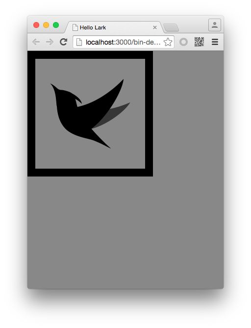
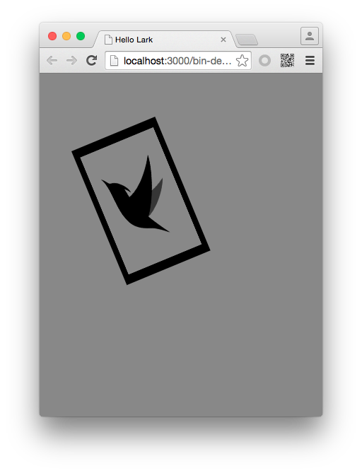

#Lark Core 编程指南 - 示例:对现实对象应用矩阵变换


在舞台中添加一张位图，通过对其 matrix 属性的修改，来改变位图的样式。

```
class Main extends lark.Sprite {
    constructor() {
        super();

        var imageLoader = new lark.ImageLoader();
        imageLoader.once(lark.Event.COMPLETE,this.onLoaded,this);
        imageLoader.load( "resources/lark.png");
    }
    private onLoaded(evt:lark.Event)
    {
        var larkBitmapData = evt.target.data;
        var img = new lark.Bitmap( larkBitmapData );
        this.addChild( img );
    }
}
```

运行后效果如图：




针对Bitmap对象的matrix属性进行设置。


```
class Main extends lark.Sprite {
    constructor() {
        super();

        var imageLoader = new lark.ImageLoader();
        imageLoader.once(lark.Event.COMPLETE,this.onLoaded,this);
        imageLoader.load( "resources/lark.png");
    }
    private onLoaded(evt:lark.Event)
    {
        var larkBitmapData = evt.target.data;
        var img = new lark.Bitmap( larkBitmapData );
        this.addChild( img );

        var mt = lark.Matrix.create();
        mt.scale(0.5, 0.8);
        mt.rotate( Math.PI * (-45 / 360) );
        mt.translate( 45, 110 );

        img.matrix = mt;
    }
}
```

运行后效果如图：


