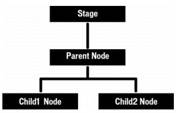
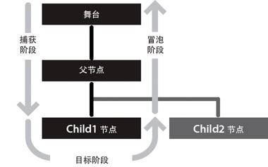

#Lark Core 编程指南 - 事件流

只要发生事件，Lark 就会调度事件对象。如果事件目标不在显示列表中，则 Lark 将事件对象直接调度到事件目标。例如，Lark 将 progress 事件对象直接调度到 URLStream 对象。但是，如果事件目标在显示列表中，则 Lark 将事件对象调度到显示列表，事件对象将在显示列表中穿行，直到到达事件目标。

"事件流"说明事件对象如何在显示列表中穿行。显示列表以一种可以描述为树的层次结构形式进行组织。位于显示列表层次结构顶部的是舞台，它是一种特殊的显示对象容器，用作显示列表的根。舞台由 lark.Stage 类表示，且只能通过显示对象访问。每个显示对象都有一个名为 stage 的属性，该属性表示应用程序的舞台。

当 Lark 调度事件对象时，该事件对象进行一次从舞台到"目标节点"的往返行程。DOM 事件规范将目标节点定义为代表事件目标的节点。也就是说，目标节点是发生了事件的显示列表对象。例如，如果用户单击名为 child1 的显示列表对象，Lark 将使用 child1 作为目标节点来调度事件对象。

从概念上来说，事件流分为三部分。第一部分称为捕获阶段，该阶段包括从舞台到目标节点的父节点范围内的所有节点。第二部分称为目标阶段，该阶段仅包括目标节点。第三部分称为冒泡阶段。冒泡阶段包括从目标节点的父节点返回到舞台的行程中遇到的节点。

如果您将显示列表想像为一个垂直的层次结构，其中舞台位于顶层（如下图显示），那么这些阶段的名称就更容易理解了：

如果用户单击 Child1 Node，Flash Player 或 AIR 将向事件流调度一个事件对象。如下面的图像所示，对象的行程从舞台开始，向下移到父节点，然后移到 Child1 节点，再“冒泡”返回到舞台（即在行程中重新经过父节点，再返回到舞台）。

在此示例中，捕获阶段在首次向下行程中包括舞台和父节点。目标阶段包括在 Child1 花费的时间。冒泡阶段包括在向上返回到根节点的行程中遇到的父节点和舞台。

在 Lark 中，您不但可以将事件侦听器添加到目标节点，还可以将它们添加到事件流中的任何节点。

当用户界面组件包含多个对象时，沿事件流添加事件侦听器的功能十分有用。例如，按钮对象通常包含一个用作按钮标签的文本对象。如果无法将侦听器添加到事件流，您将必须将侦听器添加到按钮对象和文本对象，以确保您收到有关在按钮上任何位置发生的单击事件的通知。而事件流的存在则使您可以将一个事件侦听器放在按钮对象上，以处理文本对象上发生的单击事件或按钮对象上未被文本对象遮住的区域上发生的单击事件。

不过，并非每个事件对象都参与事件流的所有三个阶段。某些类型的事件（例如 enterFrame 和 init 类型的事件）会直接调度到目标节点，并不参与捕获阶段和冒泡阶段。其他事件可能以不在显示列表中的对象为目标，例如调度到 [?] WebSocket 类的实例的事件。这些事件对象也将直接流至目标对象，而不参与捕获和冒泡阶段。

要查明特定事件类型的行为，可以查看 API 文档或检查事件对象的属性。下面的部分介绍了如何检查事件对象的属性。