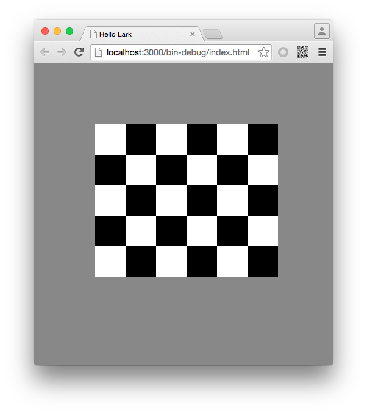

#Lark Core 编程指南 - 显示列表方法的优点


在Lark中，不同类型的显示对象被分装成不同的类。

类的这种设计和显示列表的层次结构有下列优点：

1. 基于显示列表的呈现方式更有效的减小文件体积
2. 方便的显示对象深度管理
3. 完整遍历显示列表
4. 列表外的显示对象
5. 更加容易扩展显示对象子类

##基于显示列表的呈现方式更有效的减小文件体积

在Lark中，如果你只需要通过代码绘制矢量图形，那么可以使用`Shape`类来进行绘制，此时不需要调用任何显示对象嵌套相关操作。当需要让元素之间互相嵌套的时候，可以使用到`Sprite`类，此时并不需要进行图片相关操作。

这种设计思路更加符合**单一职责**设计理念，让每一个类只做应做的事。

##方便的显示对象深度管理

在显示列表中，我们可以通过`addChild`操作将一个显示对象添加到显示列表中。我们无需关心画面中显示对象的前后关系。在显示列表中会自动处理每一个像是对象的深度，无需用户操作。当某个显示对象从显示列表中删除，则深度靠后的元素深度值被自动提前。

深度管理完全通过Lark内部自动完成，无需人工干预。当需要调换两个显示对象顺序或者修改某一个显示对象深度的时候，我们可以使用`swapChildren` 和 `setChildIndex` 方法进行操作。

##完整遍历显示列表

由于所有显示对象都继承自 `DisplayObject` ，则显示列表中的所有显示对象均可被遍历获取。

##列表外的显示对象

在Lark中，可以创建不再显示列表中的显示对象。这些对象被称之为 “列表外”显示对象。当调用显示列表中的 **DisplayObjectContainer** 实例的 `addChild` 或者 `addChildAt` 方法时，才会将显示对象添加到显示列表。

##更加容易扩展显示对象子类

在Lark中，`DisplayObject` 包括了需要内置的子类，例如 `Shape` 或 `Bitmap` 。由于Lark中的类更专注于特定类型的对象，因此更容易创建内置类的基本子类。下面代码显示了 Circle类的一个实例：

```
class Circle extends lark.Shape {
    constructor() {
        super();
        var graphics = this.graphics;
        graphics.beginPath();
        graphics.fillStyle="#0033DD";
        graphics.arc(250, 25, 50, 0, 2 * Math.PI, false);
        graphics.fill();

    }   
}
```

运行后效果如图：

