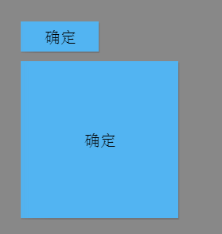

#Swan (UI库) 编程指南 - 按钮

按钮控件对应的类是 swan.Button。swan.Button 继承自 swan.Component类，因此它是可定制皮肤的。要显示一个按钮通常要给按钮指定一个皮肤，按钮的代码如下：

```  TypeScript
var button = new swan.Button();
button.width = 100;
button.height = 40;
button.label = "确定";
button.skinName = "ButtonSkin.exml";
this.addChild(button);
```

按钮的效果如下图所示：


一个按钮的皮肤通常需要有 up、down、disabled 几个状态。如果按钮没显示出来，请确认：1，您是否正确配置了皮肤，2，组件皮肤和相关素材是否在项目中.

按钮可以设置禁用，禁用的按钮会以另外一种样式显示（进入disabled视图状态），且不再响应交互，设置enabled属性可以控制是否禁用：

```  TypeScript
button.enabled = false;
```

在按钮上，可以添加事件侦听，判断当用户按下按钮后，下一步要执行的方法：

```  TypeScript
button.on(lark.TouchEvent.TOUCH_TAP,this.btnTouchHandler,this);

private btnTouchHandler(event:lark.TouchEvent):void {
    lark.log("button touched");
}
```
您可以在按钮上设置宽度和高度，按钮上的文本会自动居中，以适应不同的按钮尺寸：
```  TypeScript
var button = new swan.Button();
button.width = 100;
button.height = 40;
button.label = "确定";
this.addChild(button);
```  



下面为本章节使用到的皮肤组件代码，供您参考。

souce为图片路径，请替换成您的图片。scale9Grid为图片9宫格，请参考[Swan (UI库) 编程指南 - 图片](7-2-image.md)

ButtonSkin.exml皮肤的代码如下：

``` XML
<?xml version="1.0" encoding="utf-8" ?>
<s:Skin class="skins.ButtonSkin" states="up,down,disabled" minHeight="50" minWidth="100" xmlns:s="http://ns.egret.com/swan">
    <s:Image width="100%" height="100%" scale9Grid="1,3,8,8" alpha.disabled="0.5"
             source="resource/assets/blue/Button/button_up.png"
             source.down="resource/assets/blue/Button/button_down.png"/>
    <s:Label id="labelDisplay" top="8" bottom="8" left="8" right="8"
             fontSize="20" fontFamily="Tahoma 'Microsoft Yahei'"
             textColor="0xFFFFFF" verticalAlign="middle" textAlign="center"/>
    <s:Image id="iconDisplay" horizontalCenter="0" verticalCenter="0"/>
</s:Skin>
```
