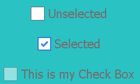

#Swan (UI库) 编程指南 - 复选框

复选框组件swan.CheckBox继承自切换按钮swan.ToggleButton，单击该按钮会在弹起状态和按下状态之间进行切换。如果在按钮处于弹起状态时单击该按钮，则它会切换到按下状态。必须再次单击该按钮才可将其切换回弹起状态。可以使用 selected 属性以编程方式获取或设置此状态。

当然复选框按钮也继承自按钮swan.Button和容器swan.Component,他具有按钮和容器的基本功能。

显示一个复选框我们通常需要一个对应的皮肤，这里我们先准备好皮肤的图片资源，如下图：


在项目中src目录下新建一个skins目录，存放我们的皮肤CheckBoxSkin.exml,具体内容如下（图片资源已经在相应路径内）:

``` XML
<?xml version="1.0" encoding="utf-8"?>
<s:Skin class="skins.CheckBoxSkin" states="up,down,disabled,upAndSelected,downAndSelected,disabledAndSelected" xmlns:s="http://ns.egret.com/swan">
    <s:Group width="100%" height="100%">
        <s:layout>
            <s:HorizontalLayout verticalAlign="middle"/>
        </s:layout>
        <s:Image fillMode="scale" alpha="1" alpha.disabled="0.5" alpha.down="0.7"
                 source="resource/assets/CheckBox/checkbox_unselect.png"
                 source.upAndSelected="resource/assets/CheckBox/checkbox_select_up.png"
                 source.downAndSelected="resource/assets/CheckBox/checkbox_select_down.png"
                 source.disabledAndSelected="resource/assets/CheckBox/checkbox_select_disabled.png"/>
        <s:Label id="labelDisplay" fontSize="20" textColor="0x707070"
                 textAlign="center" verticalAlign="middle"
                 fontFamily="Tahoma"/>
    </s:Group>
</s:Skin>
```

然后我们可以在程序中十分方便的操作复选框组件，这里新建一个swan组的类，并在其中添加一个myCheckBox属性。

``` TypeScript
class CheckBoxDemo extends swan.Group {
    public constructor() {
        super();
    }
    public myCheckBox:swan.CheckBox = new swan.CheckBox(); //新建复选框按钮.
}
```

跟前面的章节一样，我们需要给组件指定皮肤才可以让他显示出来。我们可以在构造函数中使用skinName属性指定我们刚才准备好的皮肤资源。这里皮肤资源可以是外部文件，也可以是直接指定。若是外部文件资源可以通过监听其加载完成。修改上面的代码如下：

``` TypeScript
    public constructor() {
        super();
        this.myCheckBox.skinName = "skins/CheckBoxSkin.exml"; // 指定外部皮肤.
        this.myCheckBox.once(lark.Event.COMPLETE,this.onLoaded,this); // 监听皮肤加载完成.
    }
    private onLoaded(e:lark.Event):void {
        console.log("skin load complete"); //皮肤加载完成
        this.addChild(this.myCheckBox);    //将我们的复选框添加到显示列表当中
    }
```

需要注意的是，我们的CheckBoxDemo类需要被添加至舞台，具体可参见其他章节。编译运行项目我们可以看到myCheckBox已经显示出来了。


同Button一样，我们可以指定其label属性，来添加一段描述性的文字。在以上onLoaded函数中添加如下代码，指定其描述文字.

``` TypeScript
    this.myCheckBox.label = "This is my Check Box"; //在onLoaded添加lable属性.
```

通常，我们希望能指定复选框的行为，包括选中，不被选中下的表现，可以通过监听lark.Event.CHANGE来实现，比如我们在onLoaded中添加如下代码，并添加函数onChange：

``` TypeScript
    private onLoaded(e:lark.Event):void {

        console.log("skin load complete");

        this.addChild(this.myCheckBox);
        this.myCheckBox.label = "This is my Check Box";
        this.myCheckBox.on(lark.Event.CHANGE,this.onChange,this); // 监听CHANGE事件
    }

    private onChange(e:lark.Event) {

        this.myCheckBox.label = this.myCheckBox.selected ? "Selected" : "Unselected"; // 指定lable

        console.log("onChange myCheck Box");
    }
```

同Button一样，我们也可以禁用复选框组件，设置其enabled为false即可。 这样我们就得到了如下效果的复选框了:

