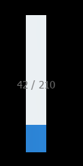

#Swan (UI库) 编程指南 - 进度条

swan.ProgressBar 进度条，我们一般用在加载某个或某组资源的时候，显示加载进程，帮助用户消磨加载过程这段无聊的时间。
跟前面的滑块 swan.Slider 控件一样，进度条控件也继承自 swan.Range 控件。也就是说 swan.Progress 进度条控件也可以设置 maximum 、minimum 、value 等属性。

#### 水平方向进度条
``` TypeScript
private pBar:swan.ProgressBar
private initProgressBar():void{
		this.pBar = new swan.ProgressBar();
		this.pBar.maximum = 210;//设置进度条的最大值
		this.pBar.minimum = 0;//设置进度条的最小值
		this.pBar.width = 200;
		this.pBar.height = 30;
		this.addChild(this.pBar);
		this.pBar.value = 42;//设置进度条的初始值
		//用timer来模拟加载进度
		var timer:egret.Timer = new egret.Timer(10,0);
		timer.on(egret.TimerEvent.TIMER,this.timerHandler,this);
		timer.start();
}
private timerHandler():void{
		this.pBar.value += 1;
		if(this.pBar.value>=210){this.pBar.value=0;}
}
```
得到的效果：


#### 垂直方向进度条
``` TypeScript
this.vBar = new swan.ProgressBar();
this.vBar.direction = swan.Direction.BTT;//从下到上
this.vBar.maximum = 210;//设置进度条的最大值
this.vBar.minimum = 0;//设置进度条的最小值
this.vBar.width = 30;
this.vBar.height = 200;
this.addChild(this.vBar);
this.vBar.value = 42;//设置进度条的初始值
```
得到的效果：



下面为本章节使用到的皮肤组件代码，供您参考。

souce为图片路径，请替换成您的图片。

ProgressBarSkin.exml皮肤的代码如下：
``` XML
<?xml version="1.0" encoding="utf-8"?>
<s:Skin class="skins.ProgressBarSkin" minWidth="30" minHeight="18" xmlns:s="http://ns.egret.com/swan">
	<s:Image source="resource/assets/blue/ProgressBar/track.png" scale9Grid="1,1,4,4" width="100%"
			 height="100%" verticalCenter="0"/>
	<s:Image id="thumb" height="100%" width="100%" source="resource/assets/blue/ProgressBar/thumb.png"/>
	<s:Label id="labelDisplay" textAlign="center" verticalAlign="middle"
			 fontSize="15" fontFamily="Tahoma" textColor="0x707070"
			 horizontalCenter="0" verticalCenter="0"/>
</s:Skin>
```
