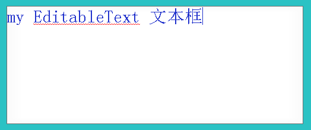
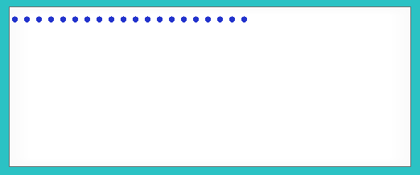
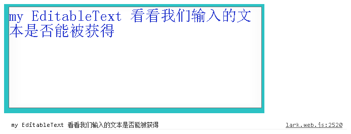

#Swan (UI库) 编程指南 - 输入文本

在 Swan 中为我们提供了输入文本控件，使用 swan.EditableText 可以创建可供用户输入的文本控件。 swan.EditableText 继承自 lark.TextInput ,也就是说使用它也可以  使用 lark.TextFild 和 lark.TextInput 的属性和方法。具体可以参照前面的章节.

这里我们准备一张图片作为背景素材:


下面我们新建一个 EditableTextDemo 类，并绘制一张背景，具体代码如下：


``` TypeScript
class EditableTextDemo extends swan.Group {
    public constructor () {
        super();
    }
    private background:swan.Image = new swan.Image();                      //新建一个背景图片
    private myEditableText:swan.EditableText = new swan.EditableText();    //新建一个输入框

}
```

我们通过 swan.EditableText() 新建了一个输入文本控件，我们接下来继续完善我们的程序，这里面涉及到前面的图片控件章节，大家可以复习一下。

``` TypeScript
class EditableTextDemo extends swan.Group {
    public constructor () {
        super();

        this.background.source = "resource/assets/checkbox_unselect.png";  //指定图片素材，这里使用上面的图片，并放入相应文件夹下
        this.background.scale9Grid = new lark.Rectangle(1.5,1.5,20,20);    //指定图片的九宫格，我们可以复习一下前面章节的内容
        this.background.width = 500;                                       //指定其宽和高，用来当做背景.
        this.background.height = 200;
        this.addChild(this.background);                                    //将背景添加到显示列表

        console.log('text demo');

        this.myEditableText.text = "my EditableText";                      //指定默认文本，用户可以自己输入，也可以将其删除
        this.myEditableText.textColor = 0x2233cc;                          //指定文本的颜色。

        this.myEditableText.width = this.background.width;                 //指定我们的文本输入框的宽和高
        this.myEditableText.height = this.background.height;               
        this.myEditableText.left = 0;                                      //设置我们的文本左边距为零

        this.addChild(this.myEditableText);                                //将他添加到显示列表

    }
    private background:swan.Image = new swan.Image();
    private myEditableText:swan.EditableText = new swan.EditableText();

}
```

需要注意的是，我们的 EditableTextDemo 类的实例需要被添加至舞台，具体可参见其他章节。编译运行项目我们可以看到 EditableTextDemo 已经显示出来了。



当然我们可以操作 myEditableText 的其他属性，比如说添加自动换行，添加密码显示等。在上面的构造函数中可以添加下面的代码，让我们看看其效果：


``` TypeScript

this.myEditableText.displayAsPassword = true;                             //添加密码显示 添加在 constructor () 内.

```



当用户输入了文本之后我们可以通过 text 属性获得用户输入的内容.首先修改一下上面的代码，添加在 constructor () 内，具体如下：

``` TypeScript
this.myEditableText.displayAsPassword = fale;                            //让文本能被显示出来.
this.myEditableText.wordWrap = true;                                     //添加自动换行.

this.myEditableText.on(lark.Event.CHANGE,this.onChang,this);             //添加监听，监听用户的输入
```

接下来添加一个处理函数，在 EditableTextDemo 内添加：
``` TypeScript
private onChang(e:lark.Event){
    lark.log(e.target.text);
}    
```

让我们来看以下效果:



当然，我们也可以使用EXML文件制作皮肤，然后使用 EXML.parse() 解析成程序里的类。可以参考相关章节.

* 上一节 [进度条](7-8-progressbar.md)