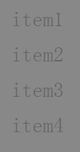

#Swan (UI库) 编程指南 - 数据容器

DataGroup，可以直译为"数据容器"。但叫"容器"又不太严谨，因为您不能将它当做普通容器来用，直接创建按钮什么的往里面添加是不行的，正确的做法是给它设置一个数据源，然后它自动创建内部所需的对象，来完成数据展示。也就是说，如果您要干预数据容器的显示，只能通过干预数据来实现，数据变了，显示就会变。

那么它是怎么实现这种"数据绑定+展示"的过程呢？如果您之前做过前端开发，应该对"模板"这种机制不陌生。假设有10条数据，需要用列表标签

```
<ul></ul>
```

显示出来，您所需要做的就是定义一条

```
<li>
```

的格式，至于数据条数就不是问题了，那是循环要解决的事情。

```
//伪代码
<ul>
    <%for(data each collection)%>
    <li><a href="{data.link}">{data.label}</a></li>
    <%end for%>
</ul>
```

对于DataGroup而言，也是类似的道理。您除了设置数据源，还要设置单条数据的"模板"。这个"模板"，在swan框架中称之为ItemRenderer。

来看看一个DataGroup的例子吧。首先，先创建数据源：

```
//先创建一个数组
var sourceArr:any[] = [];
for (var i:number = 1; i < 5; i++)
{
    sourceArr.push({label:"item"+i});
}
//用ArrayCollection包装
var myCollection:swan.ArrayCollection = new swan.ArrayCollection(sourceArr);
```

然后创建DataGroup的实例，并设置数据源(属性名称是dataProvider)：

```
var dataGroup:swan.DataGroup = new swan.DataGroup();
dataGroup.dataProvider = myCollection;
dataGroup.percentWidth = 100;
dataGroup.percentHeight = 100;
this.addChild(dataGroup);
```

写到这里直接编译运行会发生什么？当然是什么都看不到的。我们还有两个重要的工作没有做，一个是ItemRenderer，一个ItemRenderer对应的样式。

**ItemRenderer**

```
class LabelRenderer extends swan.ItemRenderer
{

	private labelDisplay:swan.Label;
    public constructor(){
        super();
        this.touchChildren = true;

        this.labelDisplay = new swan.Label();
        this.addChild( this.labelDisplay );
    }
    public dataChanged():void{
        this.labelDisplay.text = this.data.label;
    }
}
```

注意两点：

1. 自定义的ItemRenderer，应该继承swan.ItemRenderer，然后在内部添加自定义的功能
2. 将数据对应到显示的语句，应该放在dataChanged方法中，当数据改变并且皮肤已经创建完毕的情况下这个方法会被执行。这样的好处是，保证您调用的皮肤部件一定是实例化完成的。如果同样的逻辑，您放在data的setter中实现，就可能会遇到部件是null的情况，因为皮肤部件可能还未实例化完毕。

然后我们将自定义的ItemRenderer设置到DataGroup上：

```
dataGroup.itemRenderer = LabelRenderer;
```

你可以直接将 LabelRenderer 的类定义赋值给 itemRenderer 属性。

现在编译看看，欧耶，终于有显示效果了：



完整代码如下：

Main.ts

```
class Main extends swan.Group {

    public constructor() {
        super();
    }

    protected createChildren():void 
    {
        this.width = this.stage.stageWidth;
        this.height = this.stage.stageHeight;

        //先创建一个数组
        var sourceArr:any[] = [];
        for (var i:number = 1; i < 5; i++)
        {
            sourceArr.push({label:"item"+i});
        }
        //用ArrayCollection包装
        var myCollection:swan.ArrayCollection = new swan.ArrayCollection(sourceArr);

        var dataGroup:swan.DataGroup = new swan.DataGroup();
        dataGroup.dataProvider = myCollection;
        dataGroup.percentWidth = 100;
        dataGroup.percentHeight = 100;
        this.addChild(dataGroup);

        dataGroup.itemRenderer = LabelRenderer;
    }
}
```

LabelRenderer.ts

```
class LabelRenderer extends swan.ItemRenderer
{

	private labelDisplay:swan.Label;
    public constructor(){
        super();
        this.touchChildren = true;

        this.labelDisplay = new swan.Label();
        this.addChild( this.labelDisplay );
    }
    public dataChanged():void{
        this.labelDisplay.text = this.data.label;
    }
}
```


